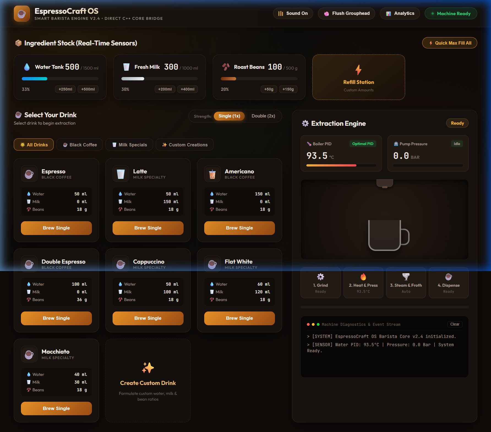

# EspressoCraft OS

> A browser-based smart coffee machine simulator with real-time brewing physics, animated visuals, and persistent session state.

## Overview

EspressoCraft OS is a fully client-side web application that simulates a professional espresso machine. It models the complete brewing pipeline — bean grinding, water heating, milk frothing, and liquid dispensing — with live sensor gauges, an animated cup fill visualisation, and a diagnostic terminal log. The project was originally developed alongside an equivalent C++ console implementation and serves as a rich UI demonstration of object-oriented design patterns ported to vanilla JavaScript.

No server, no build step, and no dependencies are required. Open `index.html` directly in any modern browser.

## Features

- **7 built-in drink recipes** — Espresso, Latte, Americano, Double Espresso, Cappuccino, Flat White, Macchiato
- **Single / Double shot toggle** — multiplies all ingredient quantities
- **Custom recipe creator** — define name, icon, water, milk, and bean ratios; recipes persist across sessions
- **Real-time inventory tracking** — water, milk, and bean tanks with low-stock warnings
- **Quick refill controls** — per-ingredient chip buttons and a full Refill Station modal with presets
- **4-stage brewing pipeline visualiser** — Grind → Heat & Pressurise → Steam & Froth → Dispense
- **Animated cup fill** — proportional liquid layers (water, espresso, milk, foam) rendered per recipe
- **Live sensor gauges** — boiler temperature PID and pump pressure with physics-based jitter simulation
- **Synthesised audio FX** — grind, steam, froth, pour, chime, sip, flush, error sounds via Web Audio API; mute toggle
- **Grouphead cleaning cycle** — automated 50 ml flush with progress indicators
- **Machine analytics modal** — lifetime cups brewed, total water/milk/beans consumed, favourite drink, last brew
- **Category filter tabs** — All / Black Coffee / Milk Specials / Custom Creations
- **Diagnostic terminal** — timestamped event log with colour-coded entry types; clearable
- **Persistent state** — inventory, custom recipes, and lifetime stats saved to `localStorage`
- **Dark espresso theme** — custom CSS design system with glassmorphism, amber accents, and micro-animations

## Tech Stack

| Layer | Technology |
|---|---|
| Markup | HTML5 |
| Styling | Vanilla CSS (custom properties, animations, glassmorphism) |
| Logic | Vanilla JavaScript (ES2017, async/await, classes) |
| Audio | Web Audio API (browser built-in) |
| Persistence | `localStorage` (browser built-in) |
| Fonts | Google Fonts — Outfit, JetBrains Mono |

No npm, no bundler, no framework, no external runtime.

## Project Structure

```
Coffee/
├── index.html          # Application shell and all HTML markup
├── css/
│   └── style.css       # Full design system — tokens, layout, components, animations
└── js/
    ├── models.js       # Recipe, Inventory, BrewingUnit classes (data + domain logic)
    ├── audio.js        # CoffeeAudio — Web Audio API synthesiser (sound singleton)
    ├── machine.js      # CoffeeMachine — orchestrates brewing, cleaning, persistence
    └── app.js          # UI controller — DOM bindings, event handlers, render loop
```

**Dependency load order** (declared in `index.html`):
`models.js` → `audio.js` → `machine.js` → `app.js`

All files expose plain global classes/variables; no module bundler is needed.

## Prerequisites

| Requirement | Notes |
|---|---|
| Modern browser | Chrome 80+, Firefox 75+, Edge 80+, Safari 14+ |
| Internet connection | Optional — only required to load Google Fonts; all functionality works offline |

No Node.js, Python, or any other runtime is required.

## Running Locally

Because the application uses plain `<script>` tags, it runs directly from the filesystem without any server.

**Option 1 — Double-click (simplest)**

Open `index.html` with your browser.

**Option 2 — Browser address bar**

```
file:///path/to/Coffee/index.html
```

**Option 3 — Local HTTP server (optional)**

Using Python:
```bash
python -m http.server 8080
# then open http://localhost:8080
```

Using Node.js:
```bash
npx serve .
# then open the printed URL
```

## Environment Variables

None. The project has no server-side component and requires no API keys.

## Building

No build step is required. The application runs directly from source files.

## Testing

No automated test suite is currently configured.

## Deployment

The application is entirely static and can be deployed to any static hosting platform.

| Platform | Method |
|---|---|
| GitHub Pages | Settings → Pages → Deploy from branch |
| Netlify | Drag the project folder into the Netlify dashboard |
| Vercel | `vercel --prod` in the project directory |
| Any web host | Upload `index.html`, `css/`, and `js/` to the document root |

No build command and no environment variables are needed on any platform.

## Configuration

Runtime behaviour can be adjusted by editing constants in the source files.

| Setting | File | Description |
|---|---|---|
| Default inventory levels | `js/models.js` — `Inventory` constructor | Starting water/milk/bean amounts and tank maximums |
| Built-in drink recipes | `js/machine.js` — `initRecipes()` | Name, icon, category, and ingredient ratios |
| Brewing step durations | `js/models.js` — `BrewingUnit` async methods | Millisecond delays per pipeline stage |
| Audio volume | `js/audio.js` — `this.volume` | Master gain scalar (0.0 – 1.0) |
| localStorage key names | `js/machine.js` — `STORAGE_KEYS` | Change to avoid collisions on a shared origin |

## Real-World Hardware Extension

EspressoCraft OS is currently a **simulator** — all brewing steps are timed delays and all sensor readings are physics-modelled in JavaScript. However, the architecture is deliberately structured so that connecting it to a real espresso machine requires changing **only one file**.

### How it works today (simulated)

```
Browser UI  →  CoffeeMachine (machine.js)  →  BrewingUnit (models.js)
                                                     ↓
                                              await sleep(1500ms)  ← fake delay
```

### How it would work with real hardware

```
Browser UI  →  CoffeeMachine (machine.js)  →  BrewingUnit (models.js)
                                                     ↓
                                         WebSocket / REST API call
                                                     ↓
                                      Raspberry Pi / ESP32 backend
                                                     ↓
                              GPIO → Relay → Pump / Heater / Grinder
                              Sensors → Thermocouple / Pressure / Flow meter
```

### The single integration point

Every brewing action flows through the async methods in `BrewingUnit` (`js/models.js`). Replacing the `sleep()` calls there with real API calls is all that is needed:

```js
// Current (simulated):
async grindBeans(grams) {
  this.onStepChange(1, 'Grinding', grams);
  await this.sleep(1500); // ← replace this
}

// Real hardware:
async grindBeans(grams) {
  this.onStepChange(1, 'Grinding', grams);
  await fetch('http://machine.local/api/grind', {
    method: 'POST',
    body: JSON.stringify({ grams })
  });
}
```

The entire UI — recipe management, inventory tracking, analytics, audio feedback, and the brewing visualiser — requires no changes.

### Suggested hardware stack

| Component | Role |
|---|---|
| Raspberry Pi 4 / ESP32 | Main controller — runs the backend API |
| K-type thermocouple + MAX31855 | Real boiler temperature readings |
| Pressure transducer (0–15 bar) | Real pump pressure readings |
| YF-S201 flow meter | Tracks actual water/milk dispensed |
| Capacitive level sensors | Water and milk tank levels |
| 4-channel relay board | Switches pump, heater, and grinder |

## Screenshots



## Contributing


1. Fork the repository and create a feature branch from `main`.
2. Make focused changes — one concern per pull request.
3. Test in at least Chrome and Firefox before submitting.
4. Describe what changed and why in the pull request description.
5. Open an issue first for large changes or new features.

## License

This project is licensed under the [MIT License](LICENSE).

## Author

**Ayush**
- GitHub: [github.com/your-username](https://github.com/your-username)
- LinkedIn: [linkedin.com/in/your-profile](https://linkedin.com/in/your-profile)

